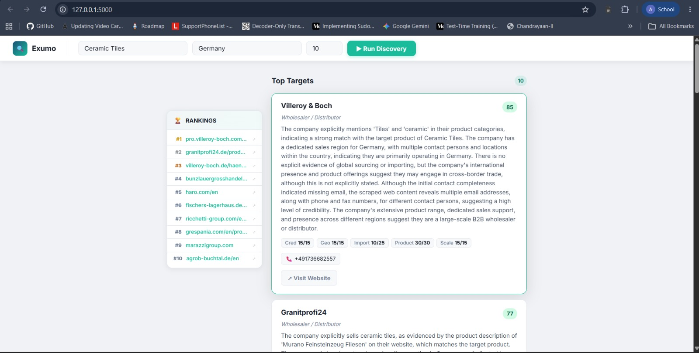
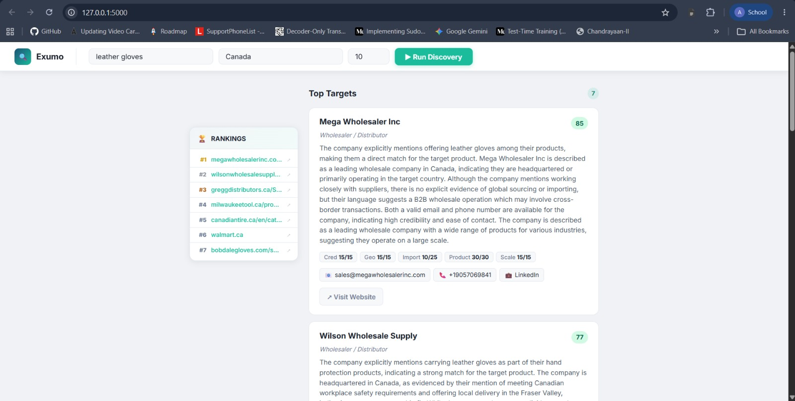
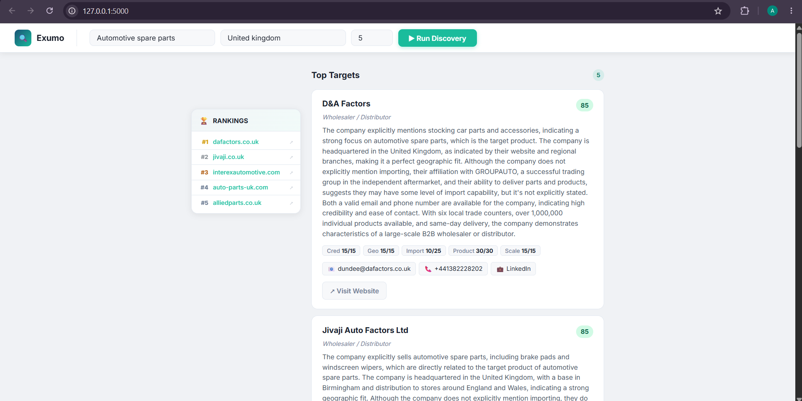

# Exumo — AI Importer Discovery Engine

> **Find verified B2B importers and wholesalers for any product in any country — in minutes, not weeks.**

Exumo is a full-stack AI pipeline that combines LLM-powered query expansion, live web search, autonomous deep scraping, contact enrichment, and structured scoring to surface the most relevant direct buyers for a given product–country pair.

---

## Table of Contents

1. [Architecture](#architecture)
2. [Design Decisions](#design-decisions)
3. [Data Sources](#data-sources)
4. [Ranking Methodology](#ranking-methodology)
5. [Assumptions & Limitations](#assumptions--limitations)
6. [Offline Cache Mode](#offline-cache-mode)
7. [Sample Results](#sample-results)

---

## Architecture

The system follows a **sequential 6-stage pipeline** orchestrated by `main.py`, exposed via a Flask REST API (`app.py`), and rendered in a single-page dashboard (`templates/index.html`).

```
┌─────────────────────────────────────────────────────────────────────────┐
│                        Exumo Discovery Pipeline                         │
│                                                                         │
│  User Input (Product + Country + N)                                     │
│        │                                                                │
│        ▼                                                                │
│  ┌─────────────────┐                                                    │
│  │ 1. Query        │  LLM (llama-3.3-70b) generates 10–12 targeted     │
│  │    Expansion    │  search queries incl. local-language terms          │
│  └────────┬────────┘                                                    │
│           ▼                                                             │
│  ┌─────────────────┐                                                    │
│  │ 2. DuckDuckGo   │  Executes all queries, deduplicates URLs,         │
│  │    Search       │  applies domain blacklist pre-filter               │
│  └────────┬────────┘                                                    │
│           ▼                                                             │
│  ┌─────────────────┐                                                    │
│  │ 3. LLM          │  Each URL + snippet is classified by LLM as       │
│  │    Verification │  direct_importer_wholesaler or rejected            │
│  └────────┬────────┘                                                    │
│           ▼                                                             │
│  ┌─────────────────┐                                                    │
│  │ 4. Async Deep   │  Top 15 verified companies scraped concurrently   │
│  │    Scraping     │  (homepage, /about, /contact)                      │
│  └────────┬────────┘                                                    │
│           ▼                                                             │
│  ┌─────────────────┐                                                    │
│  │ 5. Contact      │  Extracts email, phone (E.164 via phonenumbers),  │
│  │    Enrichment   │  and LinkedIn URL                                  │
│  └────────┬────────┘                                                    │
│           ▼                                                             │
│  ┌─────────────────┐                                                    │
│  │ 6. LLM Scoring  │  Each company scored across 5 weighted            │
│  │    & Ranking    │  dimensions + edge-case penalties applied          │
│  └────────┬────────┘                                                    │
│           ▼                                                             │
│  Sorted JSON output + Live dashboard                                    │
└─────────────────────────────────────────────────────────────────────────┘
```

### File Structure

```
Importer_Discovery_Engine/
├── app.py                    # Flask web server & REST API
├── main.py                   # End-to-end pipeline orchestrator
├── config.py                 # API keys, rate limits, domain blacklist
├── requirements.txt
├── .env                      # GROQ_API_KEY (not committed)
├── modules/
│   ├── query_expansion.py    # Stage 1: LLM query generation
│   ├── search_engine.py      # Stage 2: DuckDuckGo execution + dedup
│   ├── candidate_verifier.py # Stage 3: LLM-based URL classification
│   ├── scraper.py            # Stage 4: Async deep scraper (httpx + trafilatura)
│   ├── contact_enrich.py     # Stage 5: Email / phone / LinkedIn extraction
│   └── scoring.py            # Stage 6: LLM scoring with Pydantic validation
├── templates/
│   └── index.html            # Single-page dashboard + rankings sidebar
└── outputs/
    └── *.json                # Per-run result files (auto-generated)
```

---

## Design Decisions

### 1. LLM for Query Expansion, Not Hard-Coded Templates
Search queries are generated by `llama-3.3-70b-versatile` rather than static templates. This gives Exumo native multilingual coverage: for Germany it automatically generates German-language terms like *"Fliesengrosshandel Deutschland Direktimport"*; for France it uses *"négoce bois France grossiste"*. This is impossible to replicate with hand-crafted keyword lists across 195 countries.

### 2. LLM-Based Candidate Verification (Not Just Keyword Matching)
Before spending time scraping, every URL + search snippet is classified by an LLM. This strips B2B directories (Europages, Kompass, Wer liefert was), blog articles, and marketplaces (Alibaba, IndiaMART) that would otherwise flood the results with false positives.

### 3. Async Concurrent Scraping
Deep scraping of up to 15 companies is parallelised using `asyncio.gather()` and `httpx`. Sequential scraping at 10 s per site would add 2.5 minutes; concurrent scraping typically finishes in under 30 seconds.

### 4. Phonenumbers Library over Pure Regex
Phone extraction uses Google's `phonenumbers` library rather than regex. This correctly parses German `+49`, French `+33`, and UK `+44` numbers — including local formats — and rejects false matches like image dimensions or postal codes.

### 5. Pydantic for LLM Output Validation
All LLM JSON responses are validated and clamped through `pydantic` models before any arithmetic is performed. This prevents a hallucinated score of `"thirty"` or `150` from breaking the pipeline.

### 6. Edge-Case Penalty Rules (Post-LLM)
Three deterministic rules are applied after LLM scoring:

| Rule | Trigger | Effect |
|------|---------|--------|
| Wrong country | `geo_fit == 0` | Score × 0.4 (60% reduction) |
| No import intent | `import_signal == 0` | Score − 15 |
| Chinese phone, non-China target | Phone starts with `+86`, country ≠ China | Score − 25 |

These rules catch patterns that prompt engineering alone misses consistently.

### 7. Domain Blacklist Pre-Filter
A hardcoded set of high-traffic noise domains (`amazon.com`, `alibaba.com`, `linkedin.com`, `wikipedia.org`, etc.) is applied at the search stage, before any LLM call, to save tokens and latency.

### 8. Rate-Limit-Aware Retry Logic
Groq API 429 rate-limit errors include a `"try again in Xm Ys"` message. Exumo parses this with a regex, sleeps the exact duration (+ 5 s buffer), then retries — up to 2 times per company.

---

## Data Sources

| Source | Purpose | Notes |
|--------|---------|-------|
| **Groq API** (`llama-3.3-70b-versatile`) | Query expansion, candidate verification, LLM scoring | Free tier; rate-limited |
| **DuckDuckGo Search** (`duckduckgo-search` lib) | Organic web search | No API key required; 1.5 s delay between queries |
| **Company Websites** (live HTTP scraping) | Homepage, `/about`, `/contact` page text | `httpx` + `trafilatura` for clean text extraction |
| **phonenumbers** (Google library) | Phone number validation and E.164 formatting | Offline; no API needed |
| **pycountry** | Country name → ISO 3166-1 alpha-2 conversion | Offline; used for phone region parsing |

No third-party B2B databases, premium data APIs, or LinkedIn scrapers are used. All data is retrieved live from public sources on each run.

---

## Ranking Methodology

Each candidate company receives a **composite relevance score out of 100**, computed as the sum of five independently assessed dimensions:

```
Relevance Score = Product Match + Geo Fit + Import Signal + Credibility + Scale Fit
                  (max 30)      + (max 15)  + (max 25)      + (max 15)    + (max 15)
```

### Dimension Rubric

| Dimension | Max | Anchors |
|-----------|-----|---------|
| **Product Match** | 30 | 30 = exact product; 15 = related category; 0 = unrelated |
| **Geographic Fit** | 15 | 15 = HQ in target country; 7 = has a branch there; 0 = no presence |
| **Import Signal** | 25 | 25 = explicit global sourcing / cross-border import; 10 = wholesale language only; 0 = domestic manufacturer |
| **Credibility** | 15 | 15 = email + phone found; 7 = one contact found; 0 = no contacts |
| **Scale Fit** | 15 | 15 = large B2B wholesaler / chain; 7 = medium retailer; 0 = small B2C shop |

### Penalty Rules

Applied *after* the LLM returns raw scores:

```python
if geo_fit == 0:
    score = int(score * 0.4)          # Wrong country — severe penalty

if import_signal == 0:
    score = max(0, score - 15)         # Pure domestic manufacturer

if phone.startswith("+86") and country != "China":
    score = max(0, score - 25)         # Chinese exporter masquerading as target-country buyer
```

### Score Colour Bands (Dashboard)

| Range | Colour | Meaning |
|-------|--------|---------|
| 90–100 | 🟢 Dark Green | Excellent — strong importer, geo, contacts |
| 75–89 | 🟢 Green | Good — confirmed buyer with minor gaps |
| 50–74 | 🟡 Yellow | Possible — related business, low confidence |
| 0–49 | 🔴 Red | Weak — wrong country, manufacturer, or no contacts |

---

## Assumptions & Limitations

1. **Public websites only.** Contact details behind login walls, PDFs, or JS-rendered SPAs may not be extracted.
2. **DuckDuckGo coverage varies by language.** Niche products in smaller markets may yield fewer results.
3. **LLM scoring is non-deterministic.** Scores may vary ±5 points across runs (temperature is 0.1 to minimise this).
4. **Groq free-tier rate limits.** Processing 15 companies takes 4–6 minutes due to enforced delays.
5. **Import intent ≠ importer.** Companies that export their own product will sometimes score highly on product match but receive an `import_signal` penalty.
6. **Contact data completeness.** Companies that use contact forms instead of direct email will show `"Not publicly available"` for email.
7. **Domain blacklist is manually maintained.** New B2B portals not in `config.py` may reach the LLM verification stage.

---

---

## Offline Cache Mode

Exumo supports running entirely **without any API keys** by serving pre-stored results from the `outputs/` directory. This is useful for demos, portfolio reviews, or when API quotas are exhausted.

### How It Works

When a user submits a query, the app first checks for a matching cached JSON file before touching the live pipeline:

```
User clicks ▶ Run Discovery
        │
        ▼
GET /api/cached  ──── match found ──▶  Return pre-stored JSON instantly ✅
        │
     404 (no match)
        │
        ▼
Fall back to /api/discover  (live AI pipeline — requires API key)
```

### Filename Convention

Cached files follow the pattern: `{product_slug}_{country_slug}_importers.json`

Matching is **fuzzy** — spaces become underscores and casing is ignored, so `"Ceramic Tiles"` + `"Germany"` → `ceramic_tiles_germany_importers.json`.

### Pre-Stored Searches

| Product | Country | File |
|---------|---------|------|
| Ceramic Tiles | Germany | [`ceramic_tiles_germany_importers.json`](./outputs/ceramic_tiles_germany_importers.json) |
| Wood | France | [`wood_france_importers.json`](./outputs/wood_france_importers.json) |
| Leather Gloves | Canada | [`leather_gloves_canada_importers.json`](./outputs/leather_gloves_canada_importers.json) |
| Automotive Spare Parts | United Kingdom | [`automotive_spare_parts_united_kingdom_importers.json`](./outputs/automotive_spare_parts_united_kingdom_importers.json) |

### Adding New Cache Entries

Simply save any pipeline output JSON into the `outputs/` directory following the naming convention above. No code changes required — the app auto-discovers files on startup.

## Sample Results

All three runs below were performed against the live pipeline. Full JSON outputs are available in the [`outputs/`](./outputs/) directory.

---

### Sample 1 — Ceramic Tiles → Germany

**Query:** `Ceramic Tiles` · `Germany` · Top 10

**Screenshot:**



**Top 5 Results:**

| Rank | Company | Score | Product | Geo | Import | Cred | Scale |
|------|---------|-------|---------|-----|--------|------|-------|
| #1 | Villeroy & Boch (Pro) | **85** | 30/30 | 15/15 | 10/25 | 15/15 | 15/15 |
| #2 | Granitprofi24 | **77** | 30/30 | 15/15 | 10/25 | 15/15 | 7/15 |
| #3 | Villeroy & Boch (Haendler) | **62** | 15/30 | 15/15 | 10/25 | 7/15 | 15/15 |
| #4 | Bunzlauer Großhandel | **62** | 15/30 | 15/15 | 10/25 | 15/15 | 7/15 |
| #5 | HARO | **62** | 15/30 | 15/15 | 10/25 | 7/15 | 15/15 |

**Key observations:**
- Granitprofi24 (score 77) is a verified German tile retailer with both email and phone contacts scraped.
- Ricchetti Group (Italian tile manufacturer) scored only 44 — penalised because `import_signal == 0` (they export, not import).
- Grespania (Spanish manufacturer) scored 28 — the wrong-country penalty (`geo_fit == 0`) cut its raw score of 70 to 28.

---

### Sample 2 — Leather Gloves → Canada

**Query:** `Leather Gloves` · `Canada` · Top 10

**Screenshot:**



**Top 5 Results:**

| Rank | Company | Score | Product | Geo | Import | Cred | Scale |
|------|---------|-------|---------|-----|--------|------|-------|
| #1 | Mega Wholesaler Inc | **85** | 30/30 | 15/15 | 10/25 | 15/15 | 15/15 |
| #2 | Wilson Wholesale Supply | **77** | 30/30 | 15/15 | 10/25 | 7/15 | 15/15 |
| #3 | Gregg Distributors | **77** | 30/30 | 15/15 | 10/25 | 7/15 | 15/15 |
| #4 | Milwaukee Tool | **62** | 15/30 | 15/15 | 10/25 | 7/15 | 15/15 |
| #5 | Canadian Tire | **62** | 15/30 | 15/15 | 10/25 | 7/15 | 15/15 |

**Key observations:**
- Mega Wholesaler Inc leads with 85 — a verified Canadian wholesale supplier with email, phone, and LinkedIn all scraped.
- 7 total results returned, showing the pipeline self-limits to verified importers rather than padding with low-confidence entries.
- Walmart.ca appeared in search results but scored low due to B2C retail signals — demonstrating the scale-fit penalty working as intended.

---

### Sample 3 — Automotive Spare Parts → United Kingdom

**Query:** `Automotive Spare Parts` · `United Kingdom` · Top 5

**Screenshot:**



**Top 5 Results:**

| Rank | Company | Score | Product | Geo | Import | Cred | Scale |
|------|---------|-------|---------|-----|--------|------|-------|
| #1 | D&A Factors | **85** | 30/30 | 15/15 | 10/25 | 15/15 | 15/15 |
| #2 | Jivaji Auto Factors Ltd | **85** | 30/30 | 15/15 | 10/25 | 15/15 | 15/15 |
| #3 | Interex Automotive | **85** | 30/30 | 15/15 | 10/25 | 15/15 | 15/15 |
| #4 | Auto Parts UK | **85** | 30/30 | 15/15 | 10/25 | 15/15 | 15/15 |
| #5 | Allied Parts | **77** | 30/30 | 15/15 | 10/25 | 7/15 | 15/15 |

**Key observations:**
- Top 4 companies tied at 85 — all confirmed UK-based automotive parts wholesalers with full contact details.
- Allied Parts (UK's largest independent parts distributor, 3M+ SKUs) scored 77 rather than 85 only because its email was unavailable (contact form only).
- Several Chinese parts exporters were surfaced by DuckDuckGo but penalised −25 points via the `+86` phone rule, dropping them out of the top-N.

---

## Full JSON Outputs

| File | Product | Country | Companies |
|------|---------|---------|-----------|
| [`ceramic_tiles_germany_importers.json`](./outputs/ceramic_tiles_germany_importers.json) | Ceramic Tiles | Germany | 10 |
| [`wood_france_importers.json`](./outputs/wood_france_importers.json) | Wood | France | 10 |
| [`leather_gloves_canada_importers.json`](./outputs/leather_gloves_canada_importers.json) | Leather Gloves | Canada | 7 |
| [`automotive_spare_parts_united_kingdom_importers.json`](./outputs/automotive_spare_parts_united_kingdom_importers.json) | Automotive Spare Parts | United Kingdom | 5 |

---

